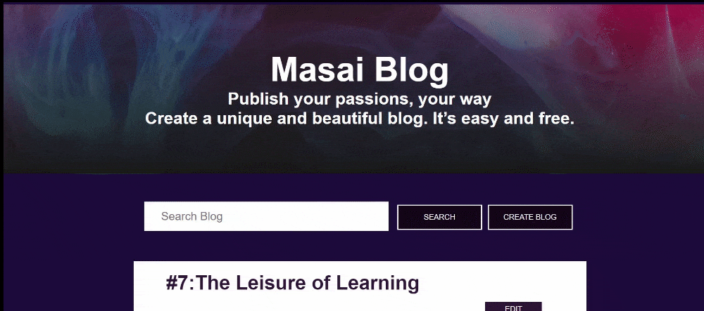
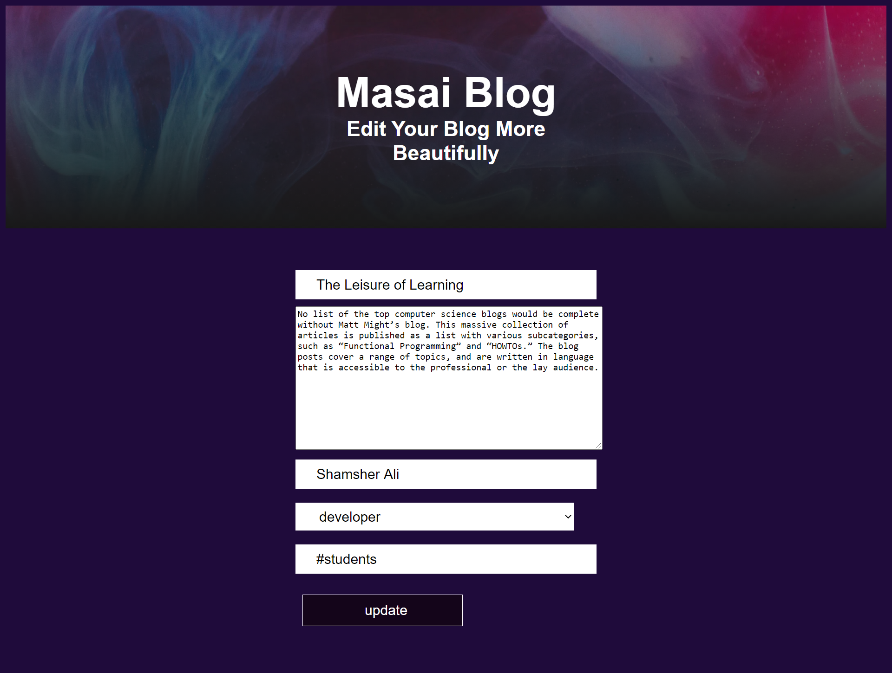

# masai-blog

Masai-Blog is a free blog websites that can be totally managed from the front-end.

<code></code>
<code></code>
<code></code>

# <a href="https://syedshamsher.github.io/masai-blog/" > Demo </a>

## <code>Sneak Peak</code>

## <code>Edit Page</code>
  

## Contributors

<h3>Shamsher Ali</h3>👨‍- <a href="https://github.com/syedshamsher" >Shamsher</a>
<h4>I take all the responsiblity for every single line of code.</h4>
